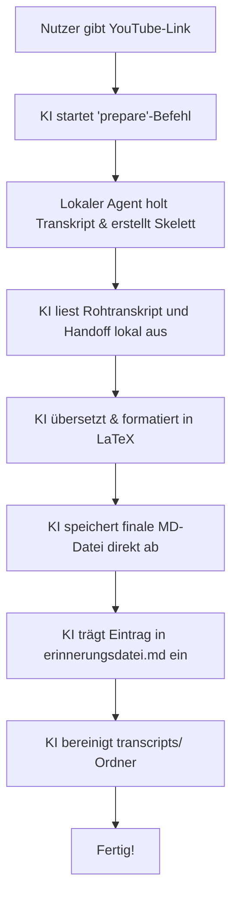

# KI-Agenten-Dokumentation: Fähigkeiten & Projektstruktur

Willkommen! Diese Datei dokumentiert die Fähigkeiten von mir (deinem KI-Programmierassistenten **Antigravity**), erklärt die Struktur dieses Projekts und beschreibt den genauen Arbeitsablauf für Video-Transkripte.

---

## 1. Meine Fähigkeiten in diesem Projekt

Ich bin darauf spezialisiert, dieses Repository zu verwalten, Skripte auszuführen und Übersetzungsarbeiten mit hoher Präzision durchzuführen. Meine Kernkompetenzen umfassen:

### 📄 Dateiverarbeitung & Code-Generierung
* **Dateien lesen & schreiben:** Ich kann Code und Markdown-Dokumente im Workspace erstellen, bearbeiten (`replace_file_content`/`multi_replace_file_content`) und organisieren.
* **Skripterstellung:** Ich schreibe Python-Hilfsskripte (wie z. B. zum Rekonstruieren fehlerhafter Edits aus Logdateien oder zur Verifikation von Dokumentenstrukturen).

### 🌐 System- & Terminal-Interaktion
* **Befehlsausführung:** Ich kann Python-Skripte und Terminal-Befehle (z. B. `transkript_agent.py`) direkt ausführen, um Medien zu bearbeiten, Repositories zu pflegen oder Tests laufen zu lassen.
* **Fehlerdiagnose:** Tritt ein Fehler auf, lese ich die Logdateien (z. B. `transcript_full.jsonl`) aus, analysiere den Stacktrace und behebe das Problem selbstständig.

### ✍️ Redaktionelle Übersetzung & Formatierung
* **Verlustfreie Übersetzung:** Übersetzung von Transkripten aus dem Russischen/Englischen ins Deutsche, wobei mindestens $$80\text{\%}$$ des ursprünglichen Inhalts erhalten bleiben (keine inhaltliche Kürzung, keine Zusammenfassungen).
* **LaTeX-Zahlenformatierung:** Konsequente Umwandlung aller Zahlen, Prozentsätze, Jahre und Einheiten in LaTeX-Syntax (z. B. `$$86\text{\%}$$`, `$$2000\text{ Jahren}$$`).
* **Werbungsfilterung:** Automatisches Erkennen und Entfernen von Werbeblöcken, Sponsorenverweisen und Outros.
* **Strukturierung:** Gliederung des Texts in übersichtliche Kapitel mit präzisen Zeitstempeln und Backlinks (`[[# Inhaltsverzeichnis]]`).

---

## 2. Projektstruktur: Wo was wie funktioniert

Das Projekt ist in feste logische Bereiche unterteilt. Hier ist die Übersicht über alle wichtigen Dateien und Ordner:

```text
Transkript/
├── AGENTS.md                                # Globale KI-Verhaltensregeln (Workflow & Schritte)
├── prompt-uebersetzer-redaktor.md           # Redaktionelle Vorgaben (Übersetzung, LaTeX, Formatierung)
├── erinnerungsdatei.md                      # Das zentrale Register aller bearbeiteten Videos
├── TRANSKRIPT_APP_PLAN.md                   # Roadmap für den Ausbau zu einer lokalen Web-App
├── Fertige Transkripte/                     # Speicherort für alle finalen deutschen Markdown-Dateien
├── transcripts/                             # Temporärer Ordner für Roh-Transkripte (wird nach Abschluss geleert)
└── transkript-agent/
    ├── transkript_agent.py                  # Konsolidierter Python-Agent (Download, Vorarbeit, Validierung, LaTeX-Formatierung)
    ├── AGENTS.md                            # Kopie der Verhaltensregeln für den lokalen Betrieb
    └── drafts/                              # Enthält Skelett- und Handoff-Dateien für aktive Arbeiten
```

---

## 3. Der Transkriptions-Workflow

Dieser Workflow ist auf maximale Effizienz (Ein-Klick-Freigabe für den Nutzer) ausgelegt:



---

## 4. Umgesetzte Verbesserungen (Konsolidierung & Linter)

Wir haben die verschiedenen Python-Skripte in ein einziges, leistungsstarkes Programm zusammengelegt und neue Qualitätswerkzeuge integriert:

* **Zusammengelegtes Programm:** Die Funktionalität zum Herunterladen der YouTube-Untertitel (`youtube_transcript.py`) wurde vollständig in `transkript_agent.py` integriert. Alle Schritte laufen über diese eine Datei.
* **Automatisierter Qualitäts-Linter (`validate`):** Ein Linter ist direkt in `transkript_agent.py` eingebaut. Er prüft fertig übersetzte Dateien automatisch auf Cardlinks, Iframes, Inhaltsverzeichnisse, Kapitel-Backlinks und LaTeX-Konformität.
* **Automatisches LaTeX-Formatting (`latexify`):** Das Programm kann Markdown-Dateien automatisch nach unformatierten Zahlen, Prozentzeichen, Einheiten und Jahreszahlen durchsuchen und diese direkt in die LaTeX-Syntax (z. B. `$$20\text{\%}$$`) konvertieren.

---

## 5. Zukünftige Verbesserungsvorschläge

Für zukünftige Versionen empfehlen wir folgende nächste Schritte:

### 📦 1. Automatischer Chunker für Videos > 45 Minuten
Änderung des `prepare`-Befehls in `transkript_agent.py`, sodass er sehr lange Transkripte automatisch in handliche Abschnitte von je $$15\text{ Minuten}$$ aufteilt. Diese können nacheinander übersetzt und anschließend fehlerfrei wieder zusammengesetzt werden. Dies verhindert Kontextverluste bei sehr langen Videos.

### 🧹 2. Automatische Werbeblock-Erkennung
Erweiterung des Agenten um eine Liste bekannter Werbe-Schlüsselwörter (z. B. *„Sponsor“*, *„Link in der Beschreibung“*, *„NordVPN“*), um Abschnitte im Rohtranskript bereits vorab als Werbung zu markieren, damit diese übersprungen werden können.
